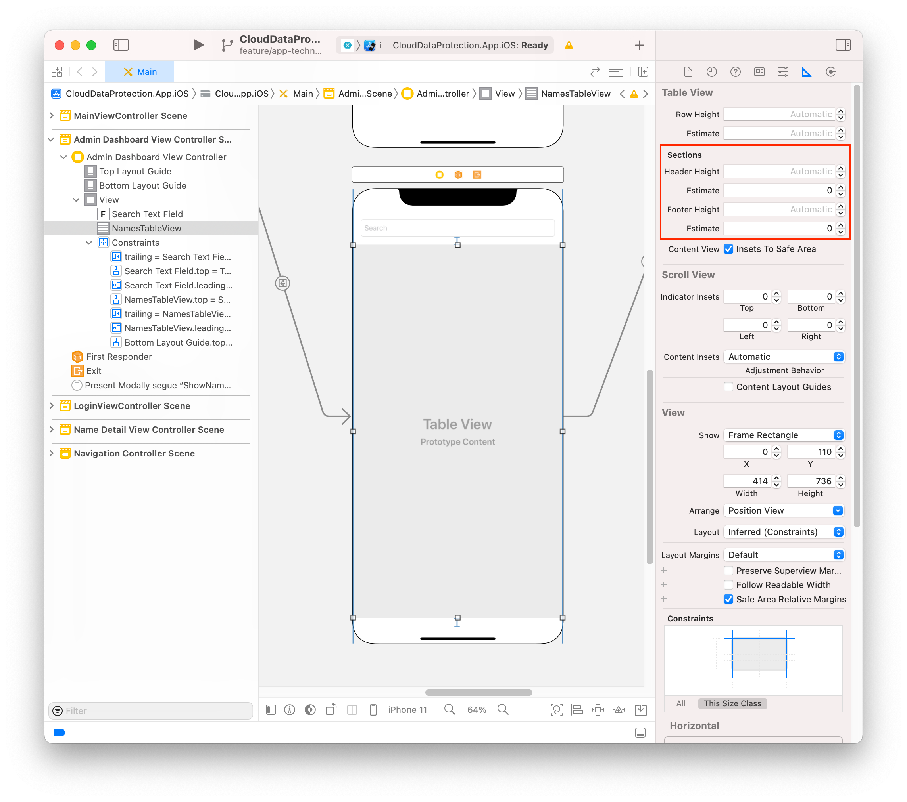

# iOS Reference

## Creating segues

See [Creating a segue (Youtube)](https://youtu.be/hAJkDoSsxL4)

## Creating unwind segues

See [Creating an unwind segue (Youtube)](https://youtu.be/5Lo9XXzq8b8)

## Aligning table view cells

To prevent a large amount of padding at the top of the `TableView`, set the `SectionHeaderTopPadding` of the `TableView` to `0` on runtime. Apply the following settings in your storyboard:



## Implementing pull to refresh

```c#
public partial class MyViewController : ReactiveViewController<MyViewModel>
{
    public MyViewController(IntPtr handle) : base(handle)
    {
    }

    public override void ViewDidLoad()
    {
        base.ViewDidLoad();

        NamesTableView.RefreshControl = new UIRefreshControl();

        this.WhenActivated(d =>
        {
            Observable.FromEventPattern (h => NamesTableView.RefreshControl.ValueChanged += h, h => NamesTableView.RefreshControl.ValueChanged -= h)
                .Subscribe (_ => OnRefresh ())
                .DisposeWith (d);
        });
    }

    private void OnRefresh()
    {
        NamesTableView.RefreshControl.EndRefreshing ();

        Observable.Return(Unit.Default).InvokeCommand(ViewModel.Search);
    }
}
```